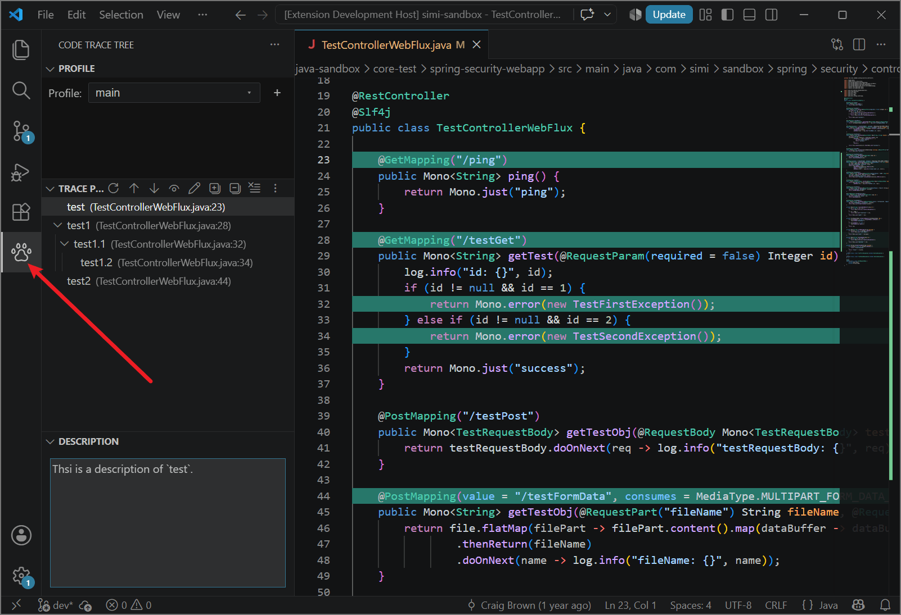
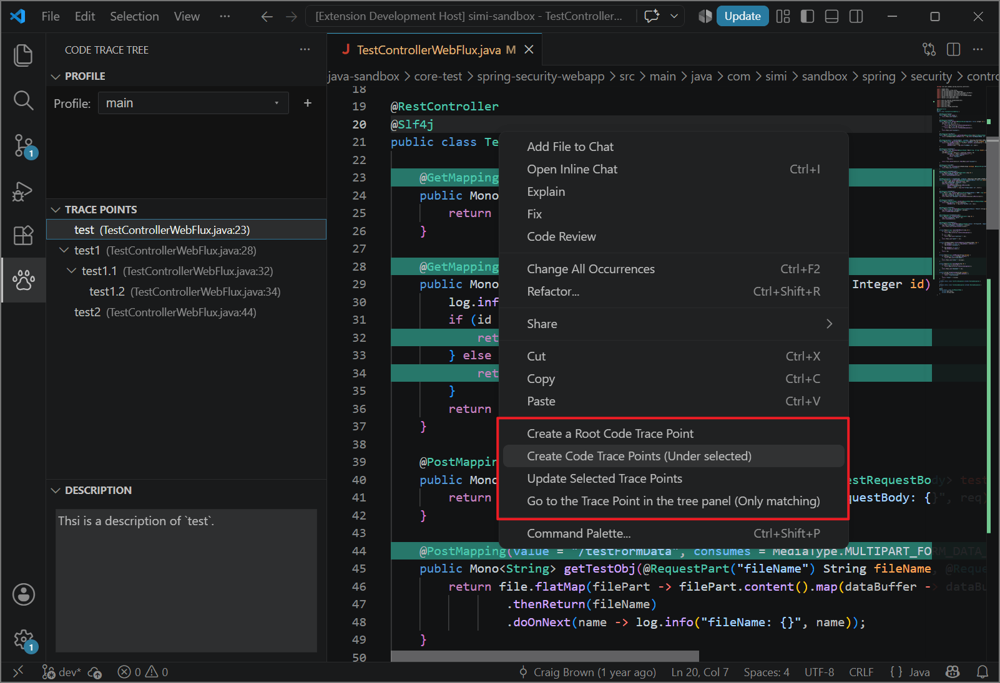

# Code Trace Tree

  
  

----

<!-- Plugin description -->

  Trace code in a tree structure with AI agent support. Build and display code workflows as nested trace points
  (lines, files, and directories) so you can follow the flow and jump back to source anytime.
  <b>Double-click</b> any trace point to navigate to its source, with support for multiple trace levels.

  Pair it with the Agent Skill so a coding agent can search, add, move, and rebind traces, and
  notify the IDE when you ask (for example Claude Code, Cursor, or Gemini CLI). 
  This extension does <b>not</b> include an AI agent; install your preferred agent separately, then
  install the <code>code-trace-tree</code> skill. Once installed, the agent can
  <b>auto-load</b> it when relevant.

<!-- Plugin description end -->

# Preview

<!-- Plugin description -->
<h1>How to use</h1>
<ol>
  <li>Open the <b>Code Trace Tree</b> activity bar view.</li>
  <li>Use the <b>Profile</b> webview above the tree to switch trees, add a profile, or delete one.</li>
  <li>In the editor, right-click a line in a <b>workspace file</b> and choose:
    <ul>
      <li><b>Create a Root Code Trace Point</b> — start a new line-level trace tree (selects the new node; does not jump)</li>
      <li><b>Create Code Trace Points (Under selected)</b> — add a child under the selected node(s) in the tree (parent expands; new node is selected)</li>
      <li><b>Update Selected Trace Points</b> — move the selected tree node(s) to the current line</li>
      <li><b>Go to the Trace Point in the tree panel (Only matching)</b> — selects and reveals matching node(s) for the current line; does nothing when none match</li>
    </ul>
  </li>
  <li>In the <b>Explorer</b>, right-click a file or directory <b>inside the workspace</b> and choose:
    <ul>
      <li><b>Create a Root File/Directory Trace Point</b> — add a file or directory node at the root</li>
      <li><b>Create File/Directory Trace Point (Under selected)</b> — add that file/directory under the selected tree node(s) (parent expands automatically)</li>
    </ul>
  </li>
  <li>Single-click a node to select it; double-click to jump to that location (line, file, or Explorer for folders). Double-click restores the prior expand/collapse state if the host toggled it (brief flicker possible).</li>
  <li>Right-click a node and choose <b>Go to Trace Point</b> (first item) to jump to that location (same as double-click).</li>
  <li>Right-click a node and choose <b>Copy Label</b> to copy its display text, e.g. <code>test233 (TestControllerWebFlux.java:54)</code>.</li>
  <li>Right-click a line trace point and choose <b>Show Line Content</b> to view its saved trimmed line text.</li>
  <li>Use the view title-bar actions to expand/collapse, <b>Recheck Trace Availability</b>, <b>Remove Invalid Trace Points</b>, reorder, highlight, prompt for name on create, or edit descriptions. Import/Export live under <b>Advanced Settings</b>. Drag a node onto another to reparent it (the target expands automatically).</li>
</ol>

  <b>TIPS:</b> Prefer creating line trace points on text that is <b>unique in that file</b> (or uncommon),
  not generic lines like <code>}</code> or <code>return;</code>. Empty lines are not allowed.
  The extension stores occurrence counts to re-find the line after it moves; unique content rebinds more reliably.

<h1>Agent Skill</h1>

  This extension does <b>not</b> ship an AI agent. Install your preferred coding agent, then install
  the <code>code-trace-tree</code> skill. Once installed, the agent can <b>auto-load</b> it when your
  request is relevant, and the IDE syncs the agent's trace-point changes as they are written.
  The skill is general — any agent that can load skill folders can use it.

Example agents:

<ul>
  <li><a href="https://claude.com/claude-code">Claude Code</a></li>
  <li><a href="https://cursor.com">Cursor</a></li>
  <li><a href="https://docs.github.com/en/copilot">GitHub Copilot</a> (agent skills)</li>
  <li><a href="https://developers.openai.com/codex">Codex</a></li>
  <li><a href="https://geminicli.com">Gemini CLI</a></li>
</ul>

The skill lets the agent:

<ul>
  <li>Resolve the bound global storage XML for the project</li>
  <li>Search, add, move, and delete trace points</li>
  <li>Rebind line locations after source edits on disk</li>
  <li>Ask the IDE to reload / refresh extension data</li>
  <li>Select or navigate to nodes in the Code Trace Tree view</li>
</ul>

<h2>Agent Skill Installation</h2>

  <b>Python required:</b> skill ops are Python scripts, so <b>Python 3</b> must be on your
  <code>PATH</code> (<code>python3</code> or <code>python</code>).

<h3>Option 1: Install from a ZIP file</h3>

  Extract the zip by hand, or run the Linux/macOS commands, or run the Windows PowerShell commands.

<ol>
  <li>Download <code>code-trace-tree-skill-1.3.5.zip</code> from the <a href="https://github.com/saidake/code-trace-tree-vscode/releases/tag/v1.3.5">GitHub Release</a> (one zip works across agents).</li>
  <li>Delete any existing <code>code-trace-tree</code> folder in the skills directory for your agent (table below), then extract the zip <b>into</b> that directory. The zip contains one <code>code-trace-tree</code> folder (with <code>SKILL.md</code> inside). Global = all projects; project-local = this repo only.</li>
</ol>

  Done when the skills directory contains <code>code-trace-tree/SKILL.md</code>
  (not the zip file, and not an extra nested <code>code-trace-tree/code-trace-tree</code> folder).

<table>
  <thead>
    <tr><th>Agent (examples)</th><th>Global</th><th>Project-local</th></tr>
  </thead>
  <tbody>
    <tr><td>Claude Code</td><td><code>~/.claude/skills/</code></td><td><code>.claude/skills/</code></td></tr>
    <tr><td>Cursor</td><td><code>~/.cursor/skills/</code></td><td><code>.cursor/skills/</code></td></tr>
    <tr><td>GitHub Copilot</td><td><code>~/.copilot/skills/</code></td><td><code>.github/skills/</code></td></tr>
    <tr><td>Codex</td><td><code>~/.agents/skills/</code></td><td><code>.agents/skills/</code></td></tr>
    <tr><td>Gemini CLI</td><td><code>~/.gemini/skills/</code></td><td><code>.gemini/skills/</code></td></tr>
  </tbody>
</table>

<b>Or</b> skip the manual extract and install from the command line (use one OS below):

  Example below is Claude Code (<code>~/.claude/skills/</code>).
  Replace <code>.claude</code> with your agent from the table
  (for example <code>.cursor</code>, <code>.copilot</code>, <code>.agents</code>, or <code>.gemini</code>).

<h4>Linux &amp; macOS</h4>
<pre><code>curl -L https://github.com/saidake/code-trace-tree-vscode/releases/download/v1.3.5/code-trace-tree-skill-1.3.5.zip -o code-trace-tree-skill-1.3.5.zip</code>
<code>rm -rf ~/.claude/skills/code-trace-tree</code>
<code>mkdir -p ~/.claude/skills</code>
<code>unzip code-trace-tree-skill-1.3.5.zip -d ~/.claude/skills/</code>
<code>rm code-trace-tree-skill-1.3.5.zip</code>
</pre>

Project-local: unzip into <code>.claude/skills/</code> (or your agent’s project-local path from the table) instead of the global folder.

<h4>Windows PowerShell</h4>

Same as the Linux/macOS commands, for Windows. Replace <code>.claude</code> with your agent from the table.

<pre><code>Invoke-WebRequest -Uri "https://github.com/saidake/code-trace-tree-vscode/releases/download/v1.3.5/code-trace-tree-skill-1.3.5.zip" -OutFile "code-trace-tree-skill-1.3.5.zip"</code>
<code>Remove-Item -Recurse -Force "$HOME\.claude\skills\code-trace-tree" -ErrorAction SilentlyContinue</code>
<code>New-Item -ItemType Directory -Force -Path "$HOME\.claude\skills" | Out-Null</code>
<code>Expand-Archive -Path "code-trace-tree-skill-1.3.5.zip" -DestinationPath "$HOME\.claude\skills" -Force</code>
<code>Remove-Item "code-trace-tree-skill-1.3.5.zip"</code>
</pre>

Project-local: extract into <code>.claude\skills\</code> (or your agent’s project-local path from the table).

<h3>Option 2: Install with npx (if you have Node.js)</h3>

  If you already have <a href="https://nodejs.org/">Node.js</a>, you can install the skill with <code>npx</code>.
  Pass <code>-g</code> for all projects; omit it for this project only.
  On Windows, add <code>--copy</code> if symlinks are not available.
  If the skill is already installed, remove it first —
  <code>npx skills add</code> does not overwrite an existing skill.

<pre><code>npx skills remove code-trace-tree -g
npx skills add saidake/code-trace-tree-skill -g</code></pre>

Or explicit, non-interactive install for the agent you currently use (Cursor example):

<pre><code>npx -y skills remove code-trace-tree --agent cursor --global --yes
npx -y skills add saidake/code-trace-tree-skill --skill code-trace-tree --agent cursor --global --copy --yes</code></pre>

  Set <code>--agent</code> to your current agent, for example
  <code>cursor</code>, <code>claude-code</code>, <code>github-copilot</code>,
  <code>codex</code>, or <code>gemini-cli</code>.

Or try without installing (Codex example; same <code>--agent</code> values):

<pre><code>npx skills use saidake/code-trace-tree-skill@code-trace-tree --agent codex</code></pre>

<h2>How to use the skill</h2>

The agent loads global or project-local skills (including the installed <code>code-trace-tree</code>).
  Use it in your agent chat:

<pre><code>Help me generate some simple trace points related to the current topic.
</code></pre>
<pre><code>Add simple trace points along the call path of method `test`.
</code></pre>

<h1>Storage</h1>

Trace data is stored in a shared global folder:

<ul>
  <li>Windows: <code>%LOCALAPPDATA%\code-trace-tree</code></li>
  <li>macOS: <code>~/Library/Application Support/code-trace-tree</code></li>
  <li>Linux: <code>$XDG_CONFIG_HOME/code-trace-tree</code> or <code>~/.config/code-trace-tree</code></li>
</ul>
<!-- Plugin description end -->

# Development

- Open the project root in VS Code / Cursor
- Install deps: `cd main && yarn install`
- Press **F5** to launch an Extension Development Host
- Shared agent skill: `https://github.com/saidake/code-trace-tree-skill` (copy in `skills/code-trace-tree/` for zip packaging)

# License

This project is licensed under the [MIT License](./LICENSE).
