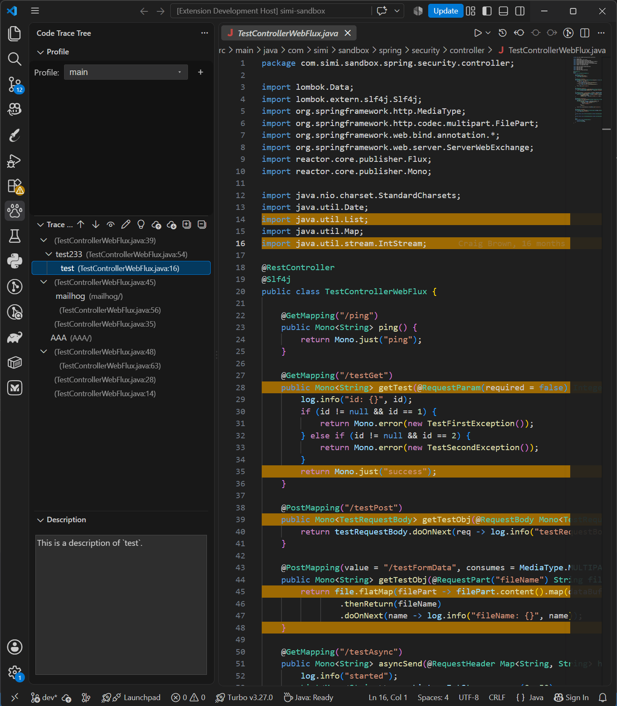

# Code Trace Tree

----

<!-- Plugin description -->

  Code Trace Tree is a VS Code extension that lets you trace code in a tree structure.
  Double-click any trace point to navigate to its source, with support for multiple trace levels.

  Pair it with the Agent Skill so Claude Code, Cursor, GitHub Copilot, Codex, or Gemini CLI can search,
  add, move, and rebind traces, and refresh the IDE when you ask. 
  This extension does <b>not</b> include an AI agent; install your preferred agent separately, then
  install and load the Code Trace Tree skill.

<!-- Plugin description end -->

# Preview

<!-- Plugin description -->
<h1>How to use</h1>
<ol>
  <li>Open the <b>Code Trace Tree</b> activity bar view.</li>
  <li>Use the <b>Profile</b> webview above the tree to switch trees, add a profile, or delete one.</li>
  <li>In the editor, right-click a line and choose:
    <ul>
      <li><b>Create a Root Code Trace Point</b> — start a new line-level trace tree</li>
      <li><b>Create Code Trace Points (Under selected)</b> — add a child under the selected node(s) in the tree</li>
      <li><b>Update Selected Trace Points</b> — move the selected tree node(s) to the current line</li>
      <li><b>Go to the Trace Point in the tree panel</b> — shown when the current line is a highlighted trace point; selects and reveals that node in the tree</li>
    </ul>
  </li>
  <li>In the <b>Explorer</b>, right-click a file or directory and choose:
    <ul>
      <li><b>Create a Root File/Directory Trace Point</b> — add a file or directory node at the root</li>
      <li><b>Create File/Directory Trace Point (Under selected)</b> — add that file/directory under the selected tree node(s)</li>
    </ul>
  </li>
  <li>Double-click a node in the tree to jump to that location (line, file, or Explorer for directories).</li>
  <li>Right-click a node and choose <b>Copy Trace Point Text</b> to copy its display text, e.g. <code>test233 (TestControllerWebFlux.java:54)</code>.</li>
  <li>Use the view title-bar actions to expand/collapse, reorder, highlight, prompt for name on create, import/export, or edit descriptions.</li>
</ol>

  <b>TIPS:</b> Prefer creating line trace points on text that is <b>unique in that file</b> (or uncommon),
  not generic lines like <code>}</code> or <code>return;</code>.
  The extension stores occurrence counts to re-find the line after it moves; unique content rebinds more reliably.

<h1>Agent Skill</h1>

  This extension does <b>not</b> ship an AI agent. Install one of the supported agents first, then install
  the Code Trace Tree skill and ensure it is <b>loaded</b> in the agent session so the agent can talk
  to the extension.

Supported agents:

<ul>
  <li><a href="https://claude.com/claude-code">Claude Code</a></li>
  <li><a href="https://cursor.com">Cursor</a></li>
  <li><a href="https://docs.github.com/en/copilot">GitHub Copilot</a> (agent skills)</li>
  <li><a href="https://developers.openai.com/codex">Codex</a></li>
  <li><a href="https://geminicli.com">Gemini CLI</a></li>
</ul>

The skill lets the agent:

<ul>
  <li>Resolve the bound global storage XML for the project</li>
  <li>Search, add, move, and delete trace points</li>
  <li>Rebind line locations after source edits on disk</li>
  <li>Ask the IDE to reload / refresh extension data</li>
  <li>Select or navigate to nodes in the Code Trace Tree view</li>
</ul>

  <b>Python required:</b> the main skill ops (<code>trace_tree</code> search / add / move / delete / rebind)
  run <code>trace_tree.py</code>, so <b>Python 3</b> must be on your <code>PATH</code>
  (<code>python3</code> or <code>python</code>).
  Resolve / refresh / select helper scripts are plain shell or batch and do not need Python.

<h2>Install skill — extract locations</h2>

  Download <code>code-trace-tree-skill-1.1.9.zip</code> from the GitHub Release
  (one zip for all agents).
  Remove any existing <code>code-trace-tree</code> skill folder first, then extract into the
  skills directory for your agent:

<table>
  <thead>
    <tr><th>Agent</th><th>Global</th><th>Project-local</th></tr>
  </thead>
  <tbody>
    <tr><td>Claude Code</td><td><code>~/.claude/skills/</code></td><td><code>.claude/skills/</code></td></tr>
    <tr><td>Cursor</td><td><code>~/.cursor/skills/</code></td><td><code>.cursor/skills/</code></td></tr>
    <tr><td>GitHub Copilot</td><td><code>~/.copilot/skills/</code></td><td><code>.github/skills/</code></td></tr>
    <tr><td>Codex</td><td><code>~/.agents/skills/</code></td><td><code>.agents/skills/</code></td></tr>
    <tr><td>Gemini CLI</td><td><code>~/.gemini/skills/</code></td><td><code>.gemini/skills/</code></td></tr>
  </tbody>
</table>

<h2>Install example (Claude Code, Linux &amp; macOS)</h2>
<pre><code>curl -L https://github.com/saidake/code-trace-tree-vscode/releases/download/v1.1.9/code-trace-tree-skill-1.1.9.zip -o code-trace-tree-skill-1.1.9.zip</code>
<code>rm -rf ~/.claude/skills/code-trace-tree</code>
<code>mkdir -p ~/.claude/skills</code>
<code>unzip code-trace-tree-skill-1.1.9.zip -d ~/.claude/skills/</code>
<code>rm code-trace-tree-skill-1.1.9.zip</code>
</pre>

Project-local: extract into <code>.claude/skills/</code> instead of <code>~/.claude/skills/</code>. For other agents, use the same zip and extract into that agent’s folder from the table above.

<h2>Install example (Claude Code, Windows PowerShell)</h2>
<pre><code>Invoke-WebRequest -Uri "https://github.com/saidake/code-trace-tree-vscode/releases/download/v1.1.9/code-trace-tree-skill-1.1.9.zip" -OutFile "code-trace-tree-skill-1.1.9.zip"</code>
<code>Remove-Item -Recurse -Force "$HOME\.claude\skills\code-trace-tree" -ErrorAction SilentlyContinue</code>
<code>New-Item -ItemType Directory -Force -Path "$HOME\.claude\skills" | Out-Null</code>
<code>Expand-Archive -Path "code-trace-tree-skill-1.1.9.zip" -DestinationPath "$HOME\.claude\skills" -Force</code>
<code>Remove-Item "code-trace-tree-skill-1.1.9.zip"</code>
</pre>

Project-local: extract into <code>.claude\skills\</code>. For Cursor / Copilot / Codex / Gemini, use the same zip and change the destination path using the table above.

<h2>How to use the skill</h2>

  After the skill is installed and <b>loaded</b> in your agent session, ask the agent in natural language.
  Mention the skill name when your agent needs an explicit skill reference:

<pre><code>Skill: code-trace-tree
Help me generate some trace point nodes related to the current topic.
</code></pre>

Other examples:

<pre><code>Skill: code-trace-tree
Add a root trace point at the login handler, then children for validation and token issue.
</code></pre>
<pre><code>Skill: code-trace-tree
Rebind line traces after my last source edits, then refresh the IDE tree.
</code></pre>

<h1>Storage</h1>

Trace data is stored in a shared global folder:

<ul>
  <li>Windows: <code>%LOCALAPPDATA%\code-trace-tree</code></li>
  <li>macOS: <code>~/Library/Application Support/code-trace-tree</code></li>
  <li>Linux: <code>$XDG_CONFIG_HOME/code-trace-tree</code> or <code>~/.config/code-trace-tree</code></li>
</ul>

  Each project uses <code>&lt;projectId&gt;.xml</code> in that folder
  (legacy <code>&lt;FolderName&gt;.xml</code> files from older releases are still resolved and
  renamed when found). The project id is stored in
  <code>.vscode/code-trace-tree.project.id</code>
  (falls back to <code>.idea/code-trace-tree.project.id</code>).

<!-- Plugin description end -->

# Development

- Open the project root in VS Code / Cursor
- Install deps: `cd main && yarn install`
- Press **F5** to launch an Extension Development Host
- Shared agent skill source: `skills/code-trace-tree/`

# License

This project is licensed under the [MIT License](./LICENSE).
